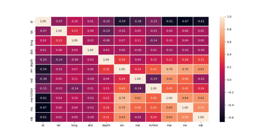
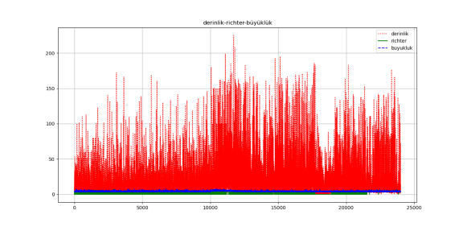

# Earthquake-Parameter-Prediction-via-Linear-Regression
One of the parameter of the earthquake data as csv file is predicted with help of Linear Regression, an algorithm of Machine Learning.

Earthquake datas can be taken from https://www.kaggle.com/caganseval/earthquake-data-distribution-of-turkey 
or from https://deprem.afad.gov.tr/depremkatalogu

Turkey's earthquake datas are used and one of the occured earthquke in Kocaeli in 2007 that has maximum magnitude 4.0 is guessed as 4.05 with linear regression. To be able create training and test datas other variables are used as well such as longitude, latitude, depth and duration magnitude. With the help of these parameters another parameter is predicted thanks to supervised learning.

For detailed explanation please check my Medium account.

[My-Medium-Account](https://medium.com/bili%C5%9Fim-hareketi/linear-regression-ile-t%C3%BCrkiyenin-deprem-verilerini-kullanarak-deprem-tahmin-modeli-olu%C5%9Fturmak-edb62112ebba "Google's Homepage")

